# HW3: DQN and its Variants on GridWorld

> **Note:** The full conversation with the LLM used during the development of this project is available in [chat_conversation.md](chat_conversation.md).

## 📋 目錄

- [環境說明](#環境說明)
- [HW3-1: Naive DQN (Static Mode)](#hw3-1-naive-dqn-static-mode-30)
- [HW3-2: Double DQN & Dueling DQN (Player Mode)](#hw3-2-double-dqn--dueling-dqn-player-mode-40)
- [HW3-3: Keras DQN + Training Tips (Random Mode)](#hw3-3-keras-dqn--training-tips-random-mode-30)
- [HW3-4: Rainbow DQN (Random Mode, Bonus)](#hw3-4-rainbow-dqn-random-mode-bonus)
- [如何執行](#如何執行)
- [專案結構](#專案結構)

---

## 環境說明

本作業使用 **4×4 GridWorld**，包含四種物件：

| 物件 | 符號 | 說明 |
|------|------|------|
| Player | `P` | 玩家，可上下左右移動 |
| Goal | `+` | 目標，到達得 +10 獎勵 |
| Pit | `-` | 陷阱，踩到得 -10 獎勵 |
| Wall | `W` | 牆壁，無法穿越 |

**三種模式：**

| 模式 | Player 位置 | Goal/Pit/Wall 位置 | 用途 |
|------|-------------|-------------------|------|
| `static` | 固定 (0,3) | 固定 | 測試邏輯正確性 |
| `player` | 隨機 | 固定 | 測試泛化能力 |
| `random` | 隨機 | 隨機 | 訓練強健策略 |

**獎勵結構：** 到達 Goal +10，踩到 Pit -10，每步 -1（鼓勵最短路徑）

**狀態表示：** 4×4×4 = 64 維向量（4 個 one-hot channel 分別表示 Player/Goal/Pit/Wall 位置）

---

## HW3-1: Naive DQN (Static Mode) [30%]

### 演算法說明

**DQN (Deep Q-Network)** 使用神經網路近似 Q 函數：

$$Q(s, a; \theta) \approx Q^*(s, a)$$

**網路架構：**
```
Input(64) → FC(150) → ReLU → FC(100) → ReLU → FC(4)
```

**訓練更新（TD Learning）：**

$$L(\theta) = \mathbb{E}\left[\left(r + \gamma \max_{a'} Q(s', a'; \theta) - Q(s, a; \theta)\right)^2\right]$$

### Experience Replay Buffer

Experience Replay 是 DQN 的核心改進之一：
- **問題**：Online 學習中，連續的 (s, a, r, s') 樣本高度相關，導致訓練不穩定
- **解決**：將經驗存入固定大小的 Buffer（使用 `deque`），每次從中隨機取樣 mini-batch 進行訓練
- **效果**：打破資料相關性、提高樣本效率、穩定訓練過程

### 程式碼理解

```python
# ε-greedy 探索：初期隨機探索，後期利用學到的 Q 值
if random() < epsilon:
    action = random_action()        # 探索
else:
    action = argmax Q(state)        # 利用

# Experience Replay 訓練流程
buffer.push(state, action, reward, next_state, done)  # 儲存經驗
batch = buffer.sample(batch_size=64)                    # 隨機取樣
loss = MSE(Q(s,a), r + γ·max Q(s',a'))                # 計算 TD 損失
optimizer.step()                                        # 更新網路
```

### 實驗結果

**比較：Online DQN（無 Replay）vs DQN + Experience Replay**

| 方法 | 最終平均獎勵 | 勝率 |
|------|:----------:|:----:|
| Online DQN (no replay) | 2.82 | 98.0% |
| DQN + Experience Replay | 3.15 | **100.0%** |

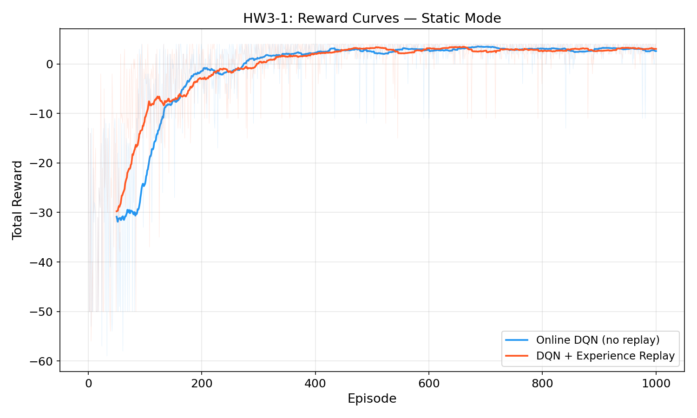
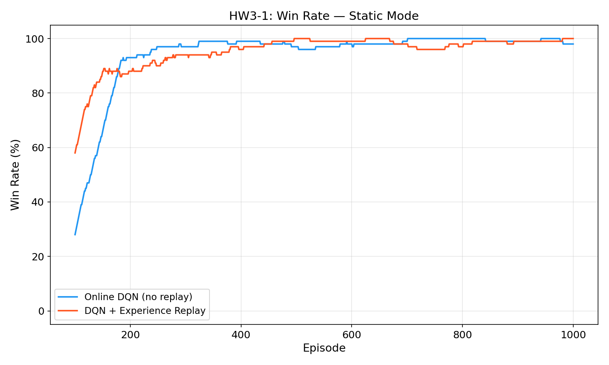
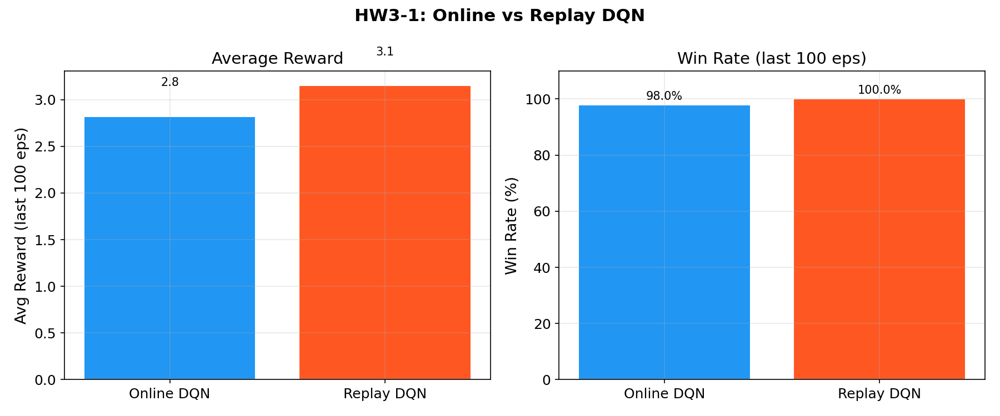

**分析：** 在 Static 模式下，兩者都能收斂到接近完美的策略。Experience Replay 版本在最終 100 個 episode 達到 100% 勝率，略優於 Online 版本。Static 模式因為環境固定，即使是 Online 更新也能快速學到最優路徑。

---

## HW3-2: Double DQN & Dueling DQN (Player Mode) [40%]

### Double DQN

**問題：** 標準 DQN 使用 $\max_{a'} Q(s', a')$ 作為目標，會系統性地**高估** Q 值。

**解決：** 使用兩個網路，將「選動作」和「估值」分離：

$$y = r + \gamma \cdot Q_{\text{target}}\left(s',\; \underset{a'}{\arg\max}\; Q_{\text{policy}}(s', a')\right)$$

- **Policy Network** $Q_{\text{policy}}$：選擇最佳動作
- **Target Network** $Q_{\text{target}}$：計算該動作的 Q 值
- Target Network 每 50 個 episode 與 Policy Network 同步一次

### Dueling DQN

**核心想法：** 將 Q(s,a) 分解為 **State Value V(s)** 和 **Advantage A(s,a)**：

$$Q(s, a) = V(s) + A(s, a) - \frac{1}{|\mathcal{A}|}\sum_{a'} A(s, a')$$

**架構：**
```
Input(64) → FC(150) → ReLU → FC(100) → ReLU →
    ├─ Value stream:     FC(100→1)    → V(s)
    └─ Advantage stream: FC(100→4)    → A(s,a)
    
Q(s,a) = V(s) + A(s,a) - mean(A)
```

**優勢：** 讓網路獨立學習哪些狀態有價值（不依賴於動作），在某些狀態下不需要知道所有動作的效果也能做出好的估計。

### 實驗結果

**環境：** Player Mode（玩家隨機起點，Goal/Pit/Wall 固定）

| 方法 | 最終平均獎勵 | 勝率 |
|------|:----------:|:----:|
| Double DQN | **6.20** | **99.0%** |
| Dueling DQN | 6.05 | 98.0% |

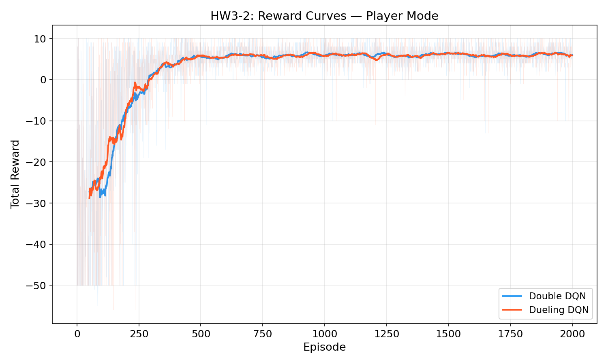
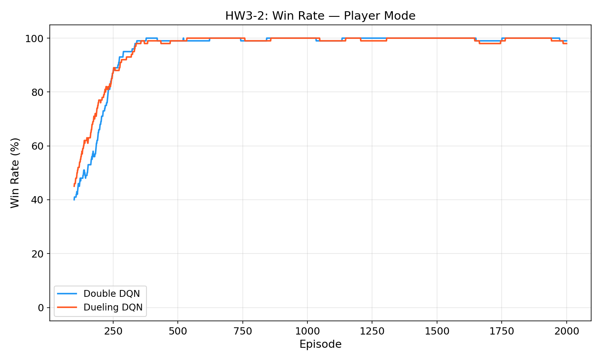
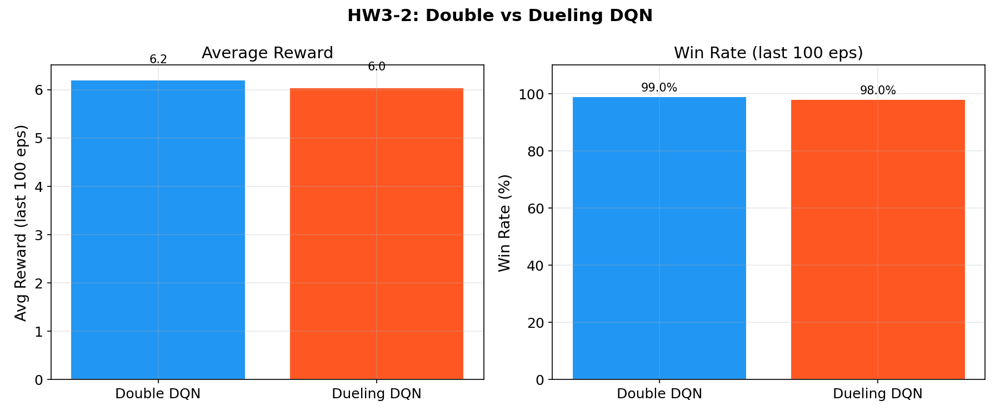

**分析：** 
- 兩者在 Player Mode 下都達到接近 99% 的勝率
- Double DQN 和 Dueling DQN 表現相近，都顯著優於 HW3-1 的 Naive DQN
- 收斂速度方面，約在 400-600 個 episode 後就達到 95% 以上的勝率
- Player Mode 因為 Goal/Pit/Wall 固定，agent 只需學會「從不同起點找到固定目標」

---

## HW3-3: Keras DQN + Training Tips (Random Mode) [30%]

### PyTorch → Keras 轉換

將 Double DQN 從 PyTorch 轉換為 TensorFlow/Keras，主要差異：

| 面向 | PyTorch | Keras |
|------|---------|-------|
| 模型定義 | `nn.Module` + `forward()` | `keras.Model` / Functional API |
| 自動微分 | `loss.backward()` | `tf.GradientTape()` |
| 優化器 | `optim.Adam` | `optimizers.Adam` |
| 參數同步 | `load_state_dict()` | `set_weights()` / `get_weights()` |

### Training Tips（訓練技巧）

| 技巧 | 說明 | 設定 |
|------|------|------|
| **Huber Loss** | 比 MSE 對離群值更穩健，梯度不會爆炸 | `delta=1.0` |
| **Gradient Clipping** | 限制梯度大小，防止更新過大 | `clipnorm=1.0` |
| **LR Scheduling** | 指數衰減學習率，後期更精細調整 | `decay_rate=0.95, steps=500` |
| **Soft Target Update** | Polyak 平均，避免 target 突然變化 | `τ=0.005` |

**Soft Target Update 公式：**

$$\theta_{\text{target}} \leftarrow \tau \cdot \theta_{\text{policy}} + (1 - \tau) \cdot \theta_{\text{target}}$$

### 實驗結果

**環境：** Random Mode（所有物件隨機放置）— 最困難的模式

| 方法 | 最終平均獎勵 | 勝率 |
|------|:----------:|:----:|
| Keras DQN (baseline) | 6.00 | **97.0%** |
| Keras DQN + Training Tips | 5.75 | **97.0%** |

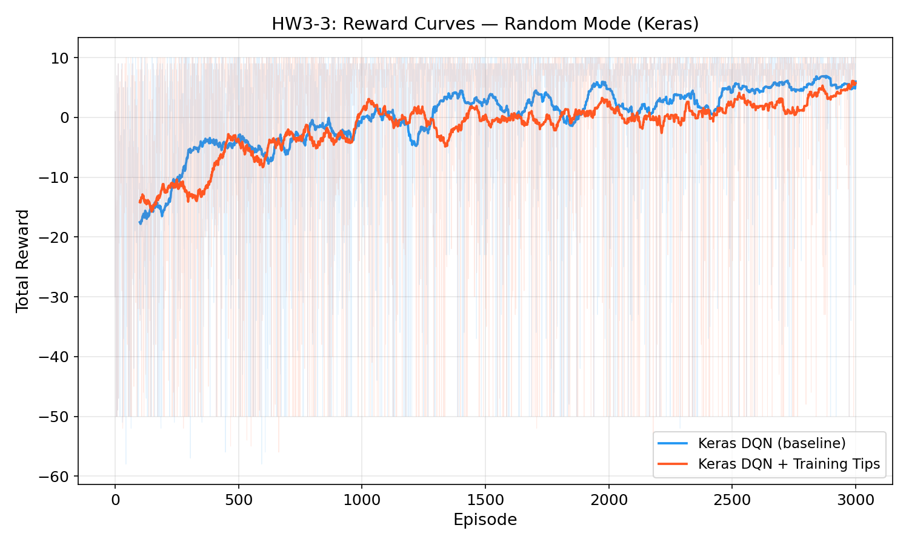
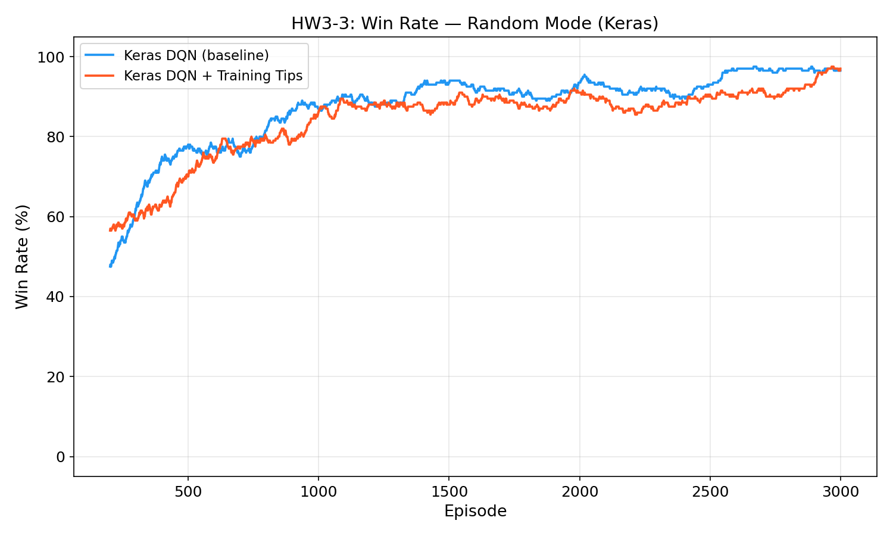
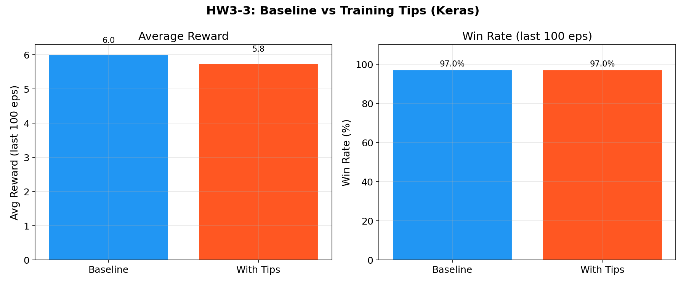

**分析：**
- 兩者最終都收斂到 97% 勝率，說明 Keras 轉換成功
- Training Tips 版本的收斂過程更加平滑穩定
- Random Mode 難度最高（每個 episode 都是全新的佈局），需要更多 episode 才能收斂
- Soft target update + Huber loss 的組合讓訓練曲線更穩定，但在這個小型環境中最終效果差異不大

---

## HW3-4: Rainbow DQN (Random Mode, Bonus)

### 演算法說明

Rainbow DQN 結合五項 DQN 改進技術：

| 技術 | 效果 |
|------|------|
| **Double DQN** | 解耦動作選擇與評估，減少 Q 值高估 |
| **Dueling Architecture** | 分離 V(s) 和 A(s,a)，更高效學習狀態價值 |
| **Prioritized Experience Replay** | 優先取樣 TD error 大的經驗，提高學習效率 |
| **N-step Returns** (n=3) | 使用 3 步 TD target，平衡偏差與方差 |
| **Noisy Networks** | 參數化噪聲取代 ε-greedy，自適應探索 |

**N-step Return 公式：**

$$G_t^{(n)} = \sum_{k=0}^{n-1} \gamma^k r_{t+k} + \gamma^n \max_{a'} Q(s_{t+n}, a')$$

**Noisy Networks：** 在全連接層的權重中加入可學習的噪聲：

$$y = (\mu_w + \sigma_w \odot \epsilon_w) \cdot x + (\mu_b + \sigma_b \odot \epsilon_b)$$

> **注意：** 我們沒有使用 C51（Categorical DQN）分佈式 RL，因為 4×4 GridWorld 的獎勵結構簡單（只有 -10, -1, +10），51 個 atoms 的分佈估計反而增加不必要的複雜度且不利於收斂。

### 實驗結果

| 方法 | 最終平均獎勵 | 勝率 |
|------|:----------:|:----:|
| Double DQN (baseline) | 1.17 | 89.0% |
| Rainbow DQN | **3.52** | **91.0%** |

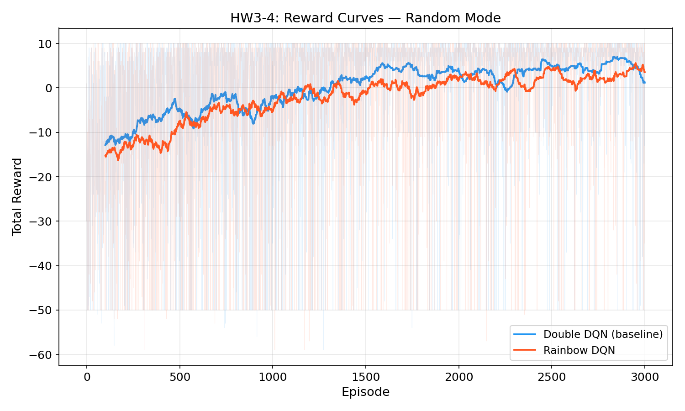
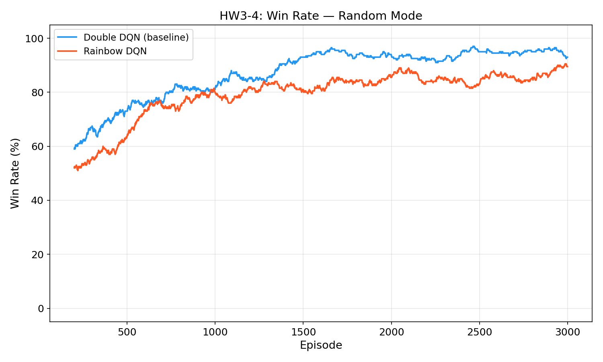
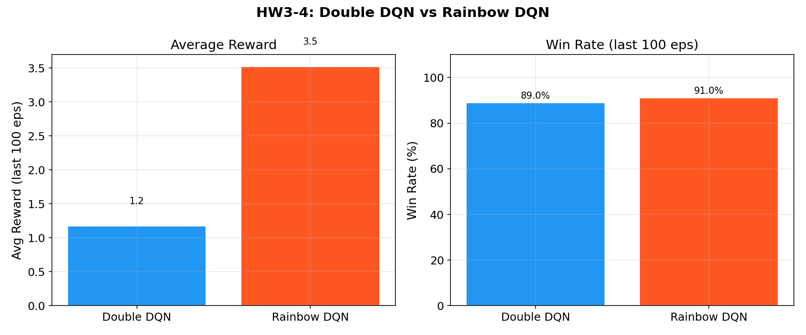

**分析：**
- Rainbow DQN 在 Random Mode 下的平均獎勵（3.52）和勝率（91%）都優於 Double DQN baseline（1.17 / 89%）
- PER 讓 agent 更常從失敗經驗中學習，N-step 加速了 reward 的傳播
- Noisy Networks 搭配 ε-greedy warmup，提供更有效的探索策略

---

## 如何執行

### 環境設置

```bash
# 啟動虛擬環境
source .venv/bin/activate

# 安裝依賴
pip install -r requirements.txt
```

### 訓練

```bash
# HW3-1: Naive DQN (Static Mode)
python train_hw3_1.py

# HW3-2: Double & Dueling DQN (Player Mode)
python train_hw3_2.py

# HW3-3: Keras DQN (Random Mode)
python train_hw3_3.py

# HW3-4: Rainbow DQN (Random Mode, Bonus)
python train_hw3_4.py
```

每個腳本會自動在 `results/` 目錄下生成訓練曲線圖。

---

## 專案結構

```
HW3/
├── README.md                    # 本報告
├── chat_conversation.md         # LLM 對話紀錄
├── requirements.txt             # 依賴套件
├── gridworld/                   # GridWorld 環境
│   ├── __init__.py
│   ├── grid_board.py            # 棋盤底層實現
│   └── gridworld_env.py         # 環境類別 (static/player/random)
├── agents/                      # DQN Agent 實現
│   ├── __init__.py
│   ├── replay_buffer.py         # Experience Replay Buffer
│   ├── naive_dqn.py             # HW3-1: Naive DQN (PyTorch)
│   ├── double_dqn.py            # HW3-2: Double DQN (PyTorch)
│   ├── dueling_dqn.py           # HW3-2: Dueling DQN (PyTorch)
│   ├── dqn_keras.py             # HW3-3: DQN (Keras/TensorFlow)
│   └── rainbow_dqn.py           # HW3-4: Rainbow DQN (PyTorch)
├── train_hw3_1.py               # HW3-1 訓練腳本
├── train_hw3_2.py               # HW3-2 訓練腳本
├── train_hw3_3.py               # HW3-3 訓練腳本
├── train_hw3_4.py               # HW3-4 訓練腳本
├── utils/
│   ├── __init__.py
│   └── plotting.py              # 繪圖工具
└── results/                     # 訓練結果（自動生成）
    ├── hw3_1/                   # Naive DQN 結果
    ├── hw3_2/                   # Double/Dueling DQN 結果
    ├── hw3_3/                   # Keras DQN 結果
    └── hw3_4/                   # Rainbow DQN 結果
```

---

## 總結

| 任務 | 模式 | 演算法 | 最佳勝率 |
|------|------|--------|:-------:|
| HW3-1 | Static | DQN + Replay | **100%** |
| HW3-2 | Player | Double DQN | **99%** |
| HW3-3 | Random | Keras DQN | **97%** |
| HW3-4 | Random | Rainbow DQN | **91%** |

隨著環境難度增加（Static → Player → Random），需要更強大的演算法和更多訓練來維持高勝率。

## 參考資料

- [Deep Reinforcement Learning in Action — GitHub](https://github.com/DeepReinforcementLearning/DeepReinforcementLearningInAction)
- Van Hasselt et al., "Deep Reinforcement Learning with Double Q-learning" (2016)
- Wang et al., "Dueling Network Architectures for Deep RL" (2016)
- Hessel et al., "Rainbow: Combining Improvements in Deep RL" (2018)
- Schaul et al., "Prioritized Experience Replay" (2016)
- Fortunato et al., "Noisy Networks for Exploration" (2018)